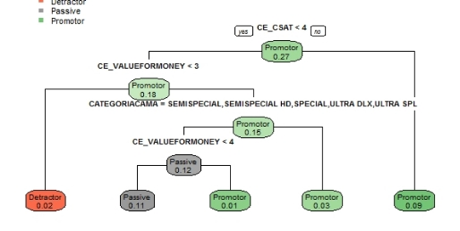
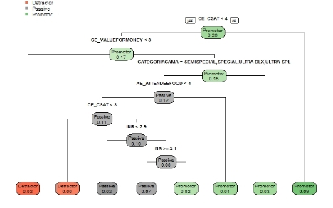
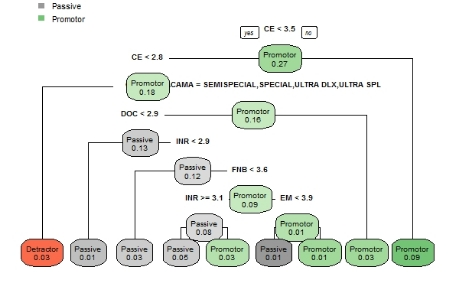
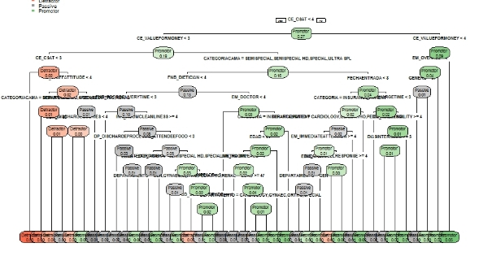
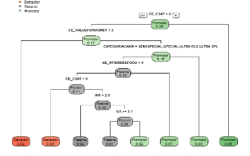

# Mejora de experiencia de pacientes por indicador (NPS)
# **Comprensión del negocio**
## **Contexto**
Tomando en cuenta la importancia de saber la opinión de los clientes sobre la experiencia y la calidad de los servicios ofrecidos por Manipal hospital, este ha contado con un sistema de recolección de inquietudes y sugerencias sobre el servicio sin embrago este en un principio se realizaba con encuentras manuales que generaban altas cargas operativas para poder procesar la información, por lo desde el 2014 con el fin de generar un proceso más ágil de recopilación que pueda generar de manera inmediata una retroalimentación sobre los comentarios realizados a los pacientes que todavía permanecen en el hospital, se empiezan a utilizar IPad por los cuales la información era más fácil traducida a material accionable. 
### **Hospitales Manipal**
Las semillas de nuestro origen se sembraron en 1953, cuando el fundador del Grupo de Educación y Medicina de Manipal (MEMG), el Dr. TMA Pai, estableció el Kasturba Medical College en Manipal, Karnataka. Los hospitales de Manipal como una entidad comenzaron a existir en 1991 con el lanzamiento de nuestro hospital insignia de 650 camas en Old Airport Road, Bangalore. Hoy, somos uno de los grupos de atención médica líderes de la India con una red de 15 hospitales y tenemos una presencia internacional a través de nuestro hospital en Malasia.

### ***Visión:*** 
Manipal Hospitals es uno de los proveedores de atención médica de múltiples especialidades más importantes de la India que atiende a pacientes indios e internacionales. Somos parte del Grupo de Educación y Medicina de Manipal (MEMG), un líder en las áreas de educación y salud. Con más de 5000 camas operativas, nuestro compromiso con el bienestar general de una persona es la base de todo lo que hacemos. A través de nuestra red de hospitales y un equipo experimentado de profesionales médicos, brindamos atención médica de calidad y asequible para todos.
### **Satisfacción de productos promotor Neto**
El promotor neto es un índice que permite a las compañías validar la calidad del servicio al cliente, en base a la pregunta: ¿Qué probabilidades hay de que recomiende esta compañía, producto o servicio a un amigo o colega? Esta pregunta se valida entonces en una escala de 0 a 10, en la cual los promotores proporcionan una puntación de 9 o 10, los clientes pasivos 1 o 8, mientras que aquellos que responden con una puntuación de 6 o menos son detractores. De manera que el NPS seria las diferencia entre promotores menos refractores.

De manera similar al estudiar, como se comporta este en indicador en relación con otras industrias encontramos que está por debajo de algunas industrias, pero no es de los más bajos. Este indicador en la industria de la salud está en un aproximado de 77% en las empresas donde es usado.

Cuidado de la salud La salud es otra industria que se ha visto afectada por los disruptores, por ejemplo, en forma de urgencia. Cuidados 31 y la creciente demanda de mejores experiencias de los pacientes. Los consumidores ahora sienten que tienen opciones en cuanto a su salud. 

Como muchas otras industrias, una gran parte de los pacientes con los que van Tiene que ver con la comodidad de estilo de vida y servicios basados ​​en la experiencia. Tecnología y servicios a medida. De los gustos de los cuidados urgentes han cambiado las prácticas tradicionales y han impactado la experiencia del paciente: 

**Citas:** Servicios como ZocDoc han proporcionado facilidad para encontrar médicos y hacer citas (sin la necesidad de plataformas de búsqueda de proveedores de seguros anticuadas y anticuadas). Esta conveniencia ha llevado a un aumento en los proveedores privados de atención médica que invierten en tecnología de telesalud. 

**Registro:** el llenado de formularios largos y el intercambio repetitivo de información han sido reemplazados por Formularios digitales de citas que facilitan el proceso de registro y reducen los tiempos de espera. 

**Transparencia de precios:** los cuidados urgentes han cambiado los servicios de salud que no son de emergencia. Pacientes ahora tener la capacidad de comparar precios de servicios a través de cuidados urgentes. 

La atención de urgencia y las clínicas de minutos deben continuar aprovechando las tecnologías, la transparencia de precios y Métricas de la experiencia del cliente para impulsar el crecimiento estratégico y la mejora de NPS. 
## **Objetivos del negocio**
- Aumentar la cantidad de clientes que utilizan los servicios del hospital.
- Brindar un servicio que aumente la satisfacción de los clientes en el hospital.
- Aumentar la tasa promedio de retención de usuarios.
## **Criterios de éxito del caso**
Basada en la experiencia del usuario en el hospital ser capaz de predecir si un cliente de hospital puede ser promotor con el fin de entender, variables claves que pueden aumentar la cantidad de clientes promotores del hospital.
## **Objetivos de la minería**
Poder generar un modelo que supere el nivel ingenuo de clasificación estimado bajo el indicador de F- Score. 
#
# **Comprensión del negocio**
Con el objetivo del negocio de entender las variables que están siendo influyentes en el indicador NPS del hospital NPS se valida el comportamiento de esta variable y de su homóloga el SCORENPS. Se encuentra que su distribución y algunos de sus estadísticos básicos que la calificación del hospital alrededor de este indicador tiende a ser alta con un promedio intercuartílico en Q2 de 8 puntos en la escala de 1 a 10, de igual manera esto se refleja en la variable NPS en la cual el 63% se califican como clientes Promotores.

Posteriormente se validan la variable de carácter demográficas que se tienen en la base (ESTADOCIVIL, EDAD, GENERO, CATEGORIACAMA, DEPARTAMENTO, GENERO, COSTOESTIMADO,..) con el fin de evaluar su comportamiento y ver si estos cuentan con valores perdidos o atípicos en este caso podemos observar que ninguna de las variables se encuentran valores perdidos, pero las variables como el COSTOESTIMADO y DIASINTERNADO tienen valores de cola derecha muy altos que nos indican alta asimetría positiva, los cuales se van a evaluar posteriormente. También se encuentra que las variables ESTADO y PAIS tiene muy poca variación haciéndolas casi variables únicas por lo que se decide excluirlas del modelo, también se decide transformar las fechas en meses y solo se toma la fecha de entrada para evitar correlaciones entre fechas.

Finalmente se evalúa el comportamiento de las variables que califican los diferentes servicios del hospital y se encuentra que todas las variables tienen un comportamiento asimétrico positivo también se puede observar que entre los mismos grupos de calificación los comportamientos suele ser similares por lo que se decide evaluar la correlaciones presentes entre calificaciones, para poder ver si la creación de nuevas variables promedio entre grupos pueden ser variables mas relevantes para la clasificación que evite el overfiting.

Como se menciono anteriormente se validan las correlaciones presentes entre las variables de evaluación de los servicios del hospital, y se confirma la hipotesis que se presente en relación con la alta correlación que se genera entre variables del mismo grupo. Principalmente en los grupos naranjas y grises en cuyo caso solo las correlaciones entre variables del mismo grupo son iguales o mayores a 0,6. Por lo que se trabajara con una predicción transformando solo las variables grises y naranjas y otra transformando todas.

# **Preparación de los datos**
## **Estructuración de los datos**
Como parte de la estructuración inicial de los datos, antes de evaluar las correlaciones entre grupos de pregunta se divide la base de train en entrenamiento y validación. Con el fin de poder evaluar los modelos baso datos en los cuales no han sido entrenado, para esto se toma una proporción 60/40 que da como resultado 2.932 pacientes para entrenamiento y 2.057 pacientes para validación.

Adicionalmente, se retiran las variables CONSECUTIVO, ID, SCORENPS, ESTADO, PAIS y FECHADESALIDA; las primeras dos debido a que son variables únicas de identificación no predictivas, y las demás por las justificaciones dadas en la compresión de los datos.

Como resultado de la compresión de los datos anterior también se generan 2 nuevos dataset en los cuales las variables de calificación son el promedio de su grupo, para todos los grupos y para los grupos resaltados anteriormente señalados en naranja y gris.
## **Formateo de datos**

Al revisar el comportamiento de las variables con valores atípicos detectadas en la exploración, se puede evidencia que este comportamiento atípico esta presente tanto en la data de prueba como de entrenamiento, sin embargo, la información de entrenamiento presenta valores mucho más inusuales por lo que se decide eliminar los registros que tengan más de 60 días de internado o que cuesten mas de $600.000 debido a que estos no representan el común de los pacientes lo que puede llevar a una precepción muy diferente de los servicios del hospital. Adicionalmente, en la variable costo se en encontraron una serie de registros en 0 a las cuales se les imputo el valor mínimo de la variable.
# **Modelado**
Como primer acercamiento a un modelo de clasificación de clientes según el indicador NPS. Se trabaja con tres arboles iniciales los cuales son uno que involucra todas las variables sin transformaciones, seguido por un segundo modelo en el cual se transforman las variables de evaluación a su promedio por grupo, finalmente un último modelo en el cual solo se transforman las variables de los grupos con correlaciones más altas (grises, naranjas).

Para su construcción de utiliza el método CHART sin modificar parámetros de control y se obtuvieron los siguientes 3 árboles. De los cuales se pueden ver los resultados de sus indicadores en la tabla de resultados. Acá observamos que el modelo que parece tener mejores indicadores de clasificación es el segundo modelo con todas las variables de grupo transformadas lo cual también se valida en la plataforma de Kaggle.

Modelo1

Modelo 2

Modelo 3

Tabla resultados primeros 3 modelos

Con base en los resultados anteriores se decide empezar a trabajar en con los parámetros de validación cruzada, Control de Cp, Tamaño de hojas y profundidad. Para esto se tomarán 2 niveles para cada uno de los modelos generando un total de 16 posibles árboles.

Descripción de los parámetros de cada modelo:

A partir de esto se encuentra que el mejor modelo es 12 el cual genera el siguiente árbol significativamente mas complejo, que nos puede indicar que no se está escogiendo el mejor modelo sino el de mejor ajuste a la base de prueba.

# **Evaluación de resultados**
Al realizar el desarrollo de un modelo de clasificación de los pacientes en las tipologías marcadas a partir del índice NPS. Encontramos que el modelo 2 se presenta como el modelo que nos da mejores resultados tanto en la base de prueba del concurso como la utilizada en el desarrollo. Por lo que es un modelo sencillo que permite accionar rápidamente y planear posibles estrategias que genere el hospital para mejorar este indicador. Este modelo presenta los siguientes resultados.

Modelo 2

Cuando vemos los resultados por categoría vemos que donde más se tiene problemas en términos de predicción es en la categoría de Detractores en la cual los indicadores apenas supera un nivel mínimo predictivo, sin embargo, el modelo sigue siendo útil para poder conocer, cuáles son las características que con las cuales las personas se sienten bien y están dispuestas a recomendar el centro de salud a otras personas.
# **Implementación**
Con base en los objetivos de negocio que se tomaron en cuenta al inicio del desarrollo se plantea proponer estrategias con base en el modelo que permitan satisfacer estas iniciativas. Al analizar el árbol de clasificación propuesto encontramos que el parámetro que nos indica 

